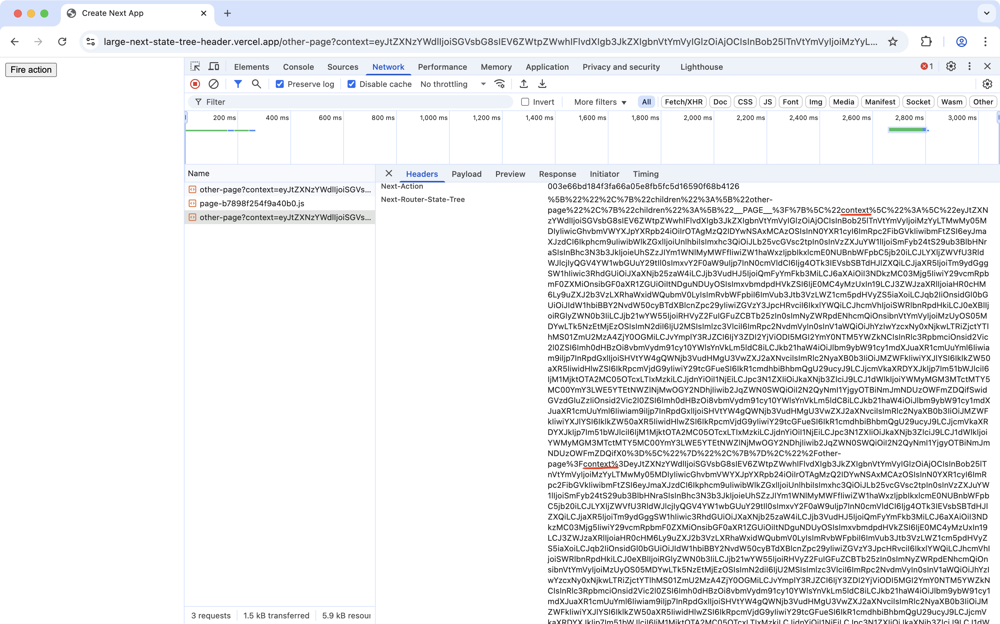

# Large `next-router-state-tree` header

Use the following steps to reproduce:

1. start the app `npm run dev`
2. navigate to `http://locahost:3000` (or [large-next-state-tree-header.vercel.app](https://large-next-state-tree-header.vercel.app))
3. Click "Redirect to other page" button (notice a long query param has been added to the `/other-page` route to demonstrate the problem)
4. Fire the server action
5. Look at the network logs for the req/res for that action fire and notice in the request headers, the `next-router-state-tree` has the query param twice.

